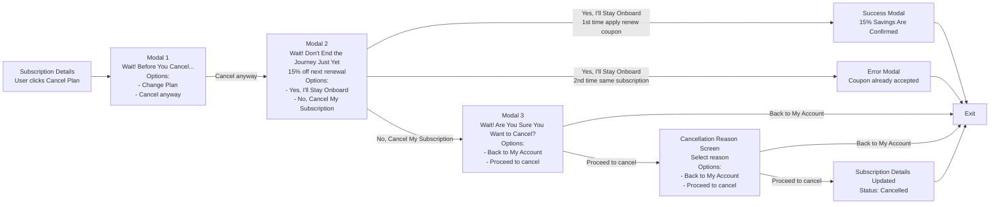

```mermaid
flowchart LR
    A[Subscription Details<br/>User clicks Cancel Plan]

    B[Modal 1<br/>Wait! Before You Cancel...<br/>Options:<br/>- Change Plan<br/>- Cancel anyway]

    C[Modal 2<br/>Wait! Don't End the Journey Just Yet<br/>15% off next renewal<br/>Options:<br/>- Yes, I'll Stay Onboard<br/>- No, Cancel My Subscription]

    D[Success Modal<br/>15% Savings Are Confirmed]

    E[Error Modal<br/>Coupon already accepted]

    F[Modal 3<br/>Wait! Are You Sure You Want to Cancel?<br/>Options:<br/>- Back to My Account<br/>- Proceed to cancel]

    G[Cancellation Reason Screen<br/>Select reason<br/>Options:<br/>- Back to My Account<br/>- Proceed to cancel]

    H[Subscription Details Updated<br/>Status: Cancelled]

    X[Exit]

    A --> B  
    B -->|Cancel anyway| C

    C -->|Yes, I'll Stay Onboard<br/>1st time apply renew coupon| D
    C -->|Yes, I'll Stay Onboard<br/>2nd time same subscription| E
    C -->|No, Cancel My Subscription| F

    D --> X
    E --> X

    F -->|Back to My Account| X
    F -->|Proceed to cancel| G

    G -->|Back to My Account| X
    G -->|Proceed to cancel| H

    H --> X
```